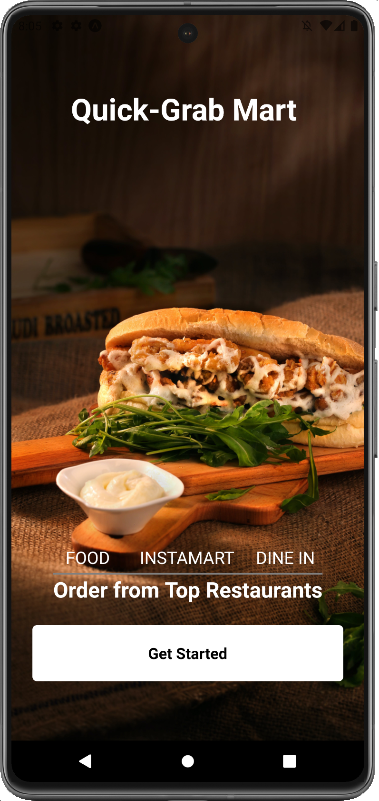
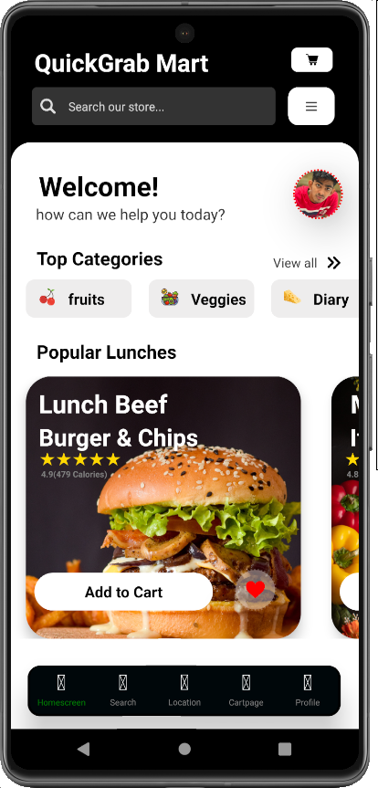
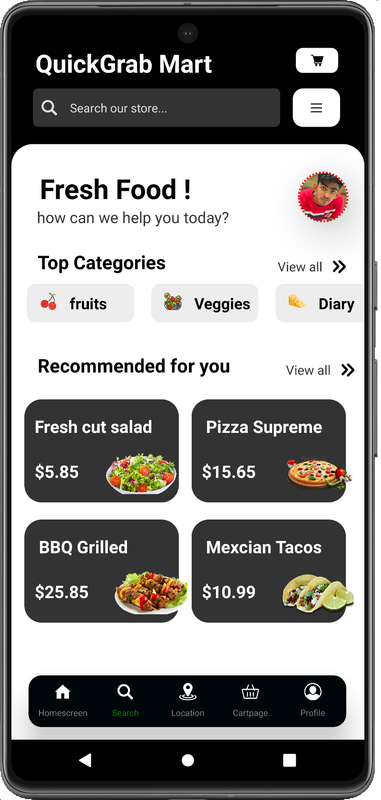
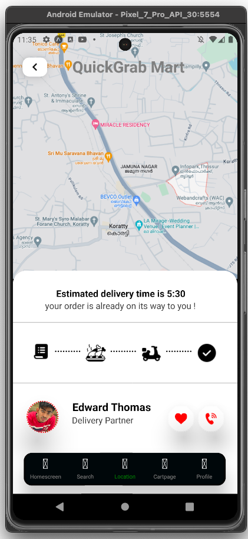
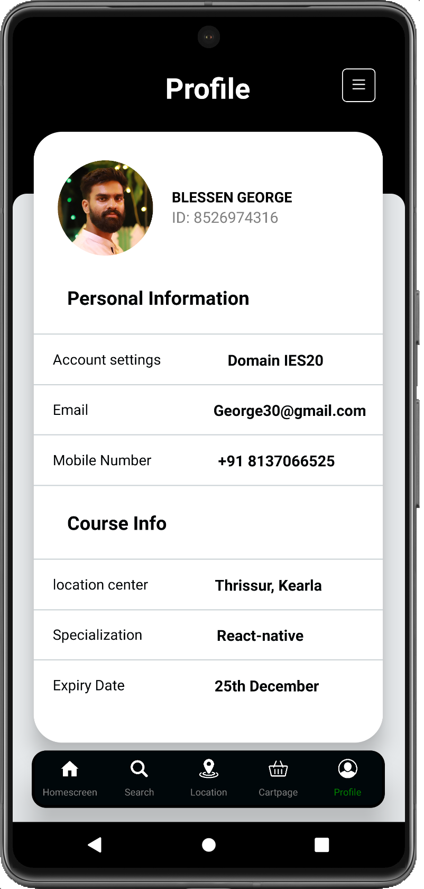

# QUICK GRAB MART
An application that connects users with nearby restaurants, allowing them to browse menus, place orders, and have food delivered to their doorstep. Users can customize orders and track the real-time status of their deliveries. The app often features ratings, reviews, and promotions to enhance the overall dining experience. With user-friendly interfaces and convenient features, food delivery apps provide a seamless way for individuals to enjoy a variety of cuisines from the comfort of their homes.

## Screenshots

## Features
Food delivery apps typically incorporate a variety of features to enhance user experience, streamline the ordering process, and ensure efficient delivery. Here are common features found in food delivery apps:

- Restaurant Listings

- Live previews

- Promotions and Discounts

- Cross platform

## 🚀 About Me

I'm a front-end React-native developer...

# Hi, I'm Blessen George! 👋

👩‍💻 I'm currently working on React-native

🧠 I'm currently learning Fundamental concepts of Javascript

⚡️ Fun fact...

