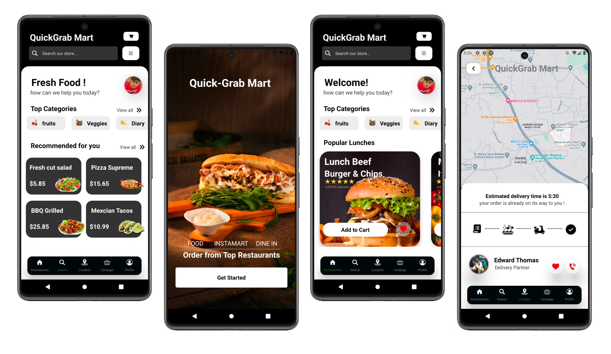

# QUICK GRAB MART

An application that connects users with nearby restaurants, allowing them to browse menus, place orders, and have food delivered to their doorstep. Users can customize orders and track the real-time status of their deliveries. The app often features ratings, reviews, and promotions to enhance the overall dining experience. With user-friendly interfaces and convenient features, food delivery apps provide a seamless way for individuals to enjoy a variety of cuisines from the comfort of their homes.

## Overview

## 🔗 Links

